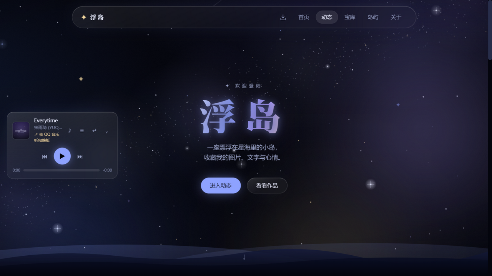
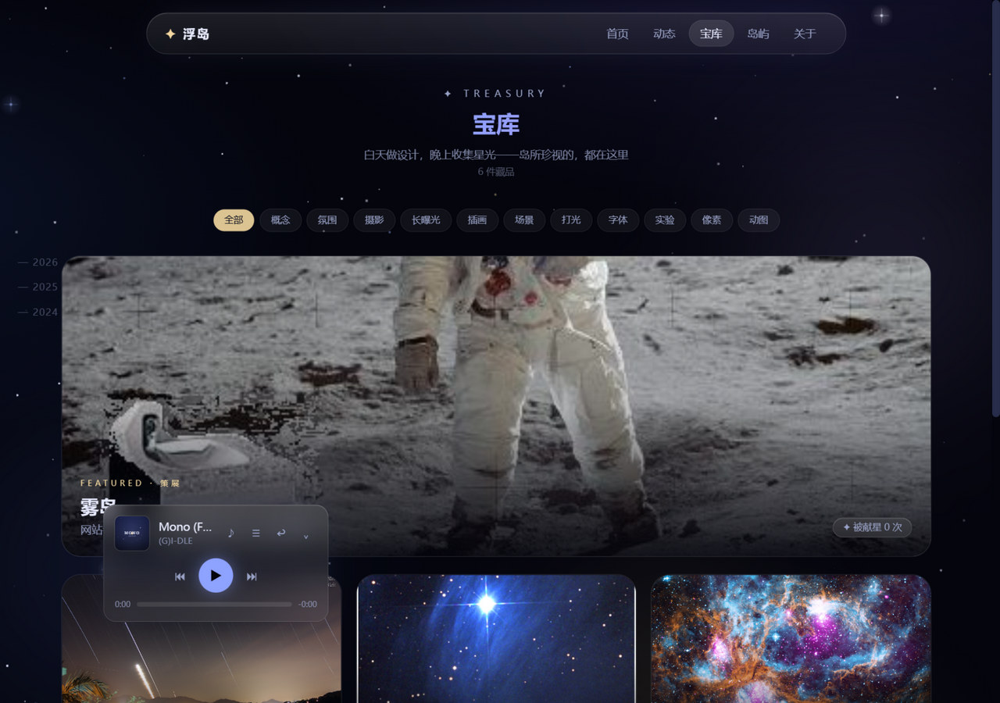

<div align="center">


# 浮岛 · Floating Island

**一座漂在星海里的个人小岛 —— 收藏图片、文字，和说不完的心情。**

[](https://jhaoz833.github.io)
[](https://github.com/jhaoz833/jhaoz833.github.io/actions/workflows/deploy.yml)
[](#-安装到桌面)
[](LICENSE)

*白天做设计，晚上收集星光。*



</div>

## ✨ 它是什么

浮岛是一座漂浮在星海里的个人小岛：发布图文动态、入藏珍视的作品、
听歌的时候让浮岛当你的逐句歌词屏。
GitHub 账号登陆上岛，每个岛民都有一座**可以装修的专属小岛**。

| 功能 | 说明 |
|---|---|
| 📝 图文动态 | 朋友圈式卡片流，发布器双模式（动态/入藏作品），每条动态带入场动画 |
| 🖼 宝库 | 作品策展展示：巡展区、观展灯箱、献星致敬 |
| 🏝 专属小岛 | GitHub 登陆后装修你的小岛，开启跟随让它漂进动态页陪你聊天 |
| 🎵 音乐灯牌 | 内置播放器 + 伴唱模式：搜一首正在听的歌，浮岛实时逐句滚动歌词 |
| 📲 PWA | 可安装到手机桌面与电脑，离线也能开壳听歌 |
| 💬 评论与点赞 | giscus（GitHub Discussions）驱动，点赞时小岛会欢呼 |



## 📥 安装到桌面

浮岛是 PWA（渐进式 Web 应用），**无需下载安装包**，浏览器内一键装成独立应用：

**Windows / macOS / Linux（Chrome / Edge）**

1. 用 Chrome 或 Edge 打开 [jhaoz833.github.io](https://jhaoz833.github.io)
2. 地址栏右侧会出现 **安装图标**（若没有，刷新一次页面）
3. 点击安装 → 独立窗口运行，任务栏/开始菜单出现浮岛图标

**Android（Chrome）**

> 菜单 → 「安装应用 / 添加到主屏幕」

**iPhone / iPad（Safari）**

> 底部分享菜单 → 「添加到主屏幕」

> [!TIP]
> 安装后断网也能打开浮岛、听已缓存的音乐；
> 导航栏的 **⬇ 图标** 随时可唤起安装引导。

> [!NOTE]
> 🚧 原生桌面安装包（Windows `.exe` / macOS `.dmg`，基于 Tauri）规划中，
> 发布后将挂在 [GitHub Releases](https://github.com/jhaoz833/fudao/releases) 供直接下载。

## 🛠 技术栈

Next.js 16（静态导出）· TypeScript · Tailwind CSS 4 · Motion（Framer Motion）·
Canvas 星空渲染 · giscus 评论 · LRCLIB 开放歌词库 · GitHub Pages + Actions 自动部署

## 🚀 本地开发

```bash
git clone https://github.com/jhaoz833/fudao.git
cd fudao
npm install
npm run dev      # http://localhost:3000
npm run build    # 静态导出到 out/
```

**资源再生成**（全部脚本化，零外部素材依赖）：

```bash
node scripts/make-placeholders.mjs    # 作品占位图 / 头像
python scripts/make-demo-track.py     # 氛围占位曲 + 歌词 + 封面
python scripts/make-intro-video.py    # 首页浮岛介绍短片
python scripts/make-icons.py          # PWA 图标组
```

## 📂 目录速览

```
app/            页面（首页 / 动态 / 宝库 / 岛屿 / 关于 / 发布器）
components/     星空画布 · 播放器 · 小岛 · 发布器 …
data/           动态 / 作品 / 音乐 / 公告（JSON）
lib/            登录 · 事件总线 · 歌词解析 · 安装状态
public/music    音频与 .lrc 歌词
scripts/        全部资源生成与构建脚本
```

## ⚖️ 内容与许可

- **代码**以 [MIT License](LICENSE) 开源，欢迎学习与借鉴
- 站内**内容**（摄影 / 插画 / 文字 / 音乐创作）版权归岛主所有，未经授权请勿转载
- 第三方曲目仅提供官方平台外链与试听片段

## 🗺 Roadmap

- [x] 岛屿系统：装修 / 跟随 / 心情 / 伴唱
- [x] PWA 可安装
- [ ] 原生桌面安装包（Tauri）
- [ ] 全系统歌词跟随（桌面端读取正在播放）
